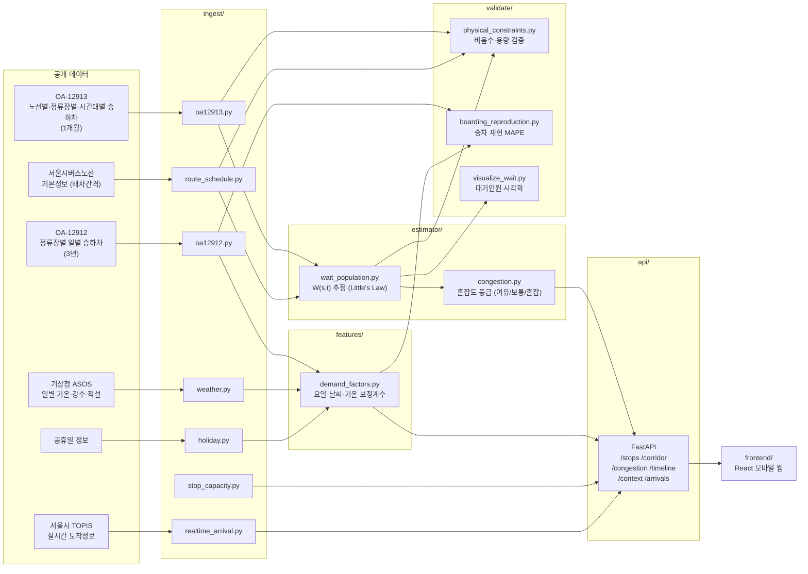

# Architecture

## 1. 문제 정의 — 대기인원은 왜 실측되지 않는가

버스 정류장에 몇 명이 서서 기다리고 있는지는 어떤 공개 데이터에도 없다. 정류장에 인원을
세는 카메라나 센서가 없고, 공개된 승하차 데이터(OA-12912/12913)는 교통카드 태그 기록이라
**실제로 탄 사람(승차)만 잡히지, 기다리다 못 탄 사람이나 그냥 지나가는 사람은 잡히지
않는다.** 그래서 대기인원 W(s,t)는 직접 측정 대상이 아니라, 실측 승차와 노선별 배차간격
같은 간접 데이터로부터 역추정해야 하는 값이다.

## 2. 기존 접근 방식 — 큐 수지(queue balance) 모델

S1(issue #4)에서 처음 시도한 접근은 저수지(reservoir) 모델이었다. 정류장의 대기인원이
시간대마다 누적·소진된다고 보고, 다음 재귀식으로 W(s,t)를 계산했다:

    W(s,t) = W(s,t-1) + A_new(s,t) + A_transfer(s,t) - B(s,t)

- `B(s,t)`: 실측 승차(그 시간대에 버스를 탄 사람 수)
- `A_transfer(s,t)`: 하차 인원 중 그 정류장에서 환승 대기로 남는 인원 (`하차 × transfer_rate`)
- `A_new(s,t)`: 그 시간대에 새로 도착해 대기를 시작하는 인원 (도착률 λ)

`transfer_rate`와 `λ`는 S1에서는 미보정 상수였고, S2(issue #9)에서 실측 승차를 목표로
scipy 최적화를 통해 정류장·시간대별로 보정했다.

## 3. 왜 이 접근인가 — Little's Law 기반 추정으로 전환한 이유

S2에서 큐 수지 모델을 검증하는 과정에서 구조적인 문제 세 가지가 확인됐다.

1. **lag 불일치**: `λ` 보정(issue #9)과 W 재귀식이 서로 다른 시간 정렬을 전제로 계산돼,
   보정된 λ를 재귀식에 그대로 넣으면 시차가 어긋난 값이 들어갔다.
2. **λ/환승률 공선성**: 큐 수지 방정식에는 `λ(t) + transfer_rate(t) × A(t)`의 합만
   나타나고 둘을 분리하는 항이 없다. 즉 이 둘을 어떻게 나눠도 같은 W를 만드는 조합이
   무한히 존재해 구조적으로 미결정(underdetermined)이었다.
3. **물리적 해상도 불일치**: 회랑의 배차간격은 평균 9분 안팎인데 원본 데이터는 1시간
   단위로만 집계된다. 즉 실제로는 한 시간에 대기열이 여러 번(약 13회) 리셋되는데,
   모델의 시간 해상도는 그걸 표현할 수 없다.

이 세 가지를 lag 스윕(0~180분)과 구간별(segment) 보정 등으로 여러 방식으로 완화해봤지만,
"함의 대기시간"(W ÷ 승차 × 60으로 역산한, 그 W가 성립하려면 필요한 평균 대기 분)을 실제
배차간격과 비교하는 물리적 타당성 검사에서 최선의 튜닝 조합으로도 61~73%가 물리적으로
불가능한 대기시간을 의미했다 — 실제 배차간격보다 긴 대기를 모델이 요구하는 셈이다.

세 문제 모두 모델을 더 정교하게 다듬는다고 해결되는 게 아니라 구조 자체의 한계였기
때문에, S2 중반에 재귀식·보정 기반 큐 수지 모델을 폐기하고 Little's Law 기반 추정으로
교체했다.

## 4. 추정 방법 — W(s,t) 계산 구조

`estimator/wait_population.py`는 Little's Law(L = λW)를 노선별로 적용한다:

    W(s,t) = Σ_r B_r(s,t) × (배차간격_r / 2) × (1 + cv_r²) / 60

- `B_r(s,t)`: 노선 r이 정류장 s의 시간대 t에 태운 실측 승차(명/시간)
- `배차간격_r / 2`: 완전히 규칙적인 배차를 가정했을 때, 임의의 시점에 도착한 승객의
  평균 대기시간(대기시간 역설의 분산 0 케이스)
- `(1 + cv_r²)`: 배차가 불규칙(bunching)할 때의 보정항. `cv_r`은 노선별 등록된
  최소/최대 배차에서 유도한다 — 배차간격이 [최소배차, 최대배차] 구간에 균등분포한다고
  가정하면 표준편차는 `(최대배차-최소배차)/√12`이고, `cv_r = 표준편차 / 배차간격`이다
  (issue #80/PR #81). 배차 정보가 없는 노선은 같은 정류장의 다른 노선들의 중앙값으로
  대체한다.

기존 모델과의 결정적 차이는 **저수지(이월) 항이 없다는 것**이다. 매 시간대의 W는 그
시간대의 실측 승차만으로 독립적으로 계산되고, 이전 시간대 값을 참조하지 않는다. 최적화로
보정하는 자유 파라미터도 없다 — 배차간격·최소/최대배차 모두 실측 데이터(서울시버스노선
기본정보)에서 직접 가져온다. 이 모델이 성립하려면 "정류장에 사람이 밀려서 다음 시간대로
넘어가는 이월(carryover)이 없다"는 전제가 필요한데, 이건 모델 스스로 증명할 수 없는
현실에 대한 가정이라 `validate/physical_constraints.py`의 용량 제약 검사로 실측
데이터를 통해 별도로 확인한다 (`docs/s3_validation_report.md` §1).

## 5. 시스템 아키텍처 다이어그램

데이터는 왼쪽(공개 원본)에서 오른쪽(프론트엔드)으로 단방향으로 흐른다. `data/processed/`
아래 parquet 파일들이 각 단계 사이의 경계다 — 로컬에서 각 모듈을 순서대로(`ingest` →
`features` → `estimator` → `validate`) 실행해 채운다(`data/README.md` §8).

## 6. API 계약

FastAPI(`api/main.py`)가 노출하는 엔드포인트:

| 엔드포인트 | 설명 |
|---|---|
| `GET /health` | 헬스체크 |
| `GET /stops` | 회랑 21개 정류장의 표시용 메타데이터(이름·좌표·ARS번호 등) |
| `GET /stops/{id}/congestion` | 한 정류장·한 시간대의 추정 대기인원과 혼잡도 등급 |
| `GET /stops/{id}/timeline` | 한 정류장의 24시간 전체 대기인원 곡선(시간대별 등급 포함) |
| `GET /corridor` | 한 시간대 기준 회랑 21개 정류장 전체 스냅샷 |
| `GET /stops/{id}/context` | 한 정류장·한 날짜의 요일/날씨 맥락과 혼잡도 코멘트 |
| `GET /stops/{id}/arrivals` | 노선별 실시간 도착정보 (서울시 TOPIS 연동, issue #48) |

`/congestion`과 `/corridor`는 `hour` 쿼리 파라미터를 선택적으로 받는다. `hour`를
명시하면 그 시간대의 과거 평균 패턴 값을 그대로 반환하고, 생략하면 "현재값"을
반환한다. 지금은 이 "현재값"이 `_current_hour()`로 현재 시각을 그 시간대의 과거 평균
테이블에 매핑하는 방식으로 구현돼 있지만, 이 설계는 나중에 실시간 데이터로 전환할 여지를
남겨두고 만들었다 — `hour` 생략 시의 "현재값 조회" 로직만 실시간 저장소 조회로 바꾸면
되고, 요청/응답 스키마를 포함한 API 계약 자체는 그대로 유지된다. 즉 실시간 전환 비용은
`ingest/`·`features/`(재캘리브레이션) 쪽에만 들고 API를 쓰는 프론트엔드는 영향을 받지
않는다.

응답 스키마는 [`docs/openapi.json`](./docs/openapi.json)에 freeze되어 있다.
`api/main.py`·`api/schemas.py`를 바꾸면 `python scripts/export_openapi.py`로 재생성해야
CI가 통과한다.
